## Solutions for 100 Days of SwiftUI
Course by: Paul Hudson

### Certificate
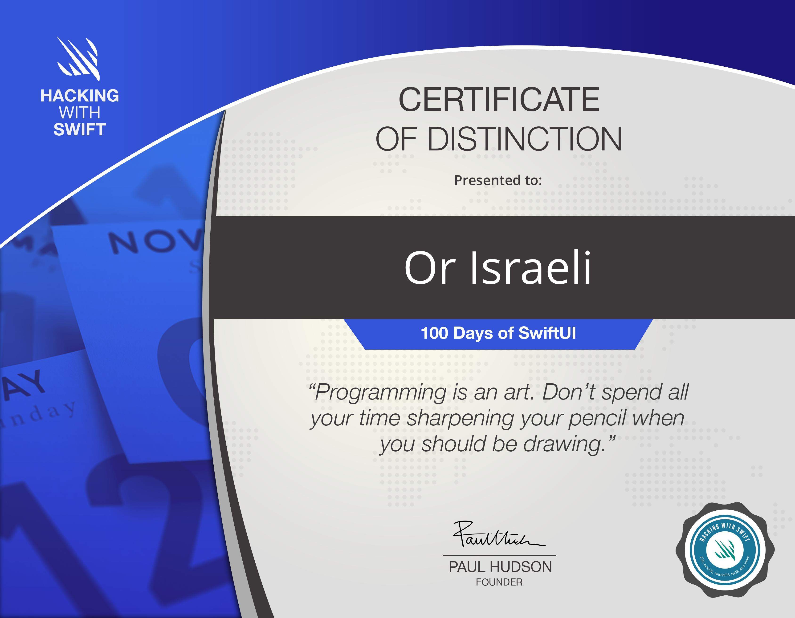

---

### Project 1: WeSplit
A check-sharing app that calculates how to split a check based on the number of people and how much tip you want to leave.

---

### Challenge 1: Unit Convert
An app to handle temperature units conversion between Celsius, Fahrenheit, or Kelvin. The user can select input and output temperature units and see the conversion result.

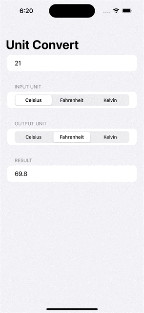

---

### Project 2: Guess The Flag
A trivia game that helps users learn some of the many flags of the world.

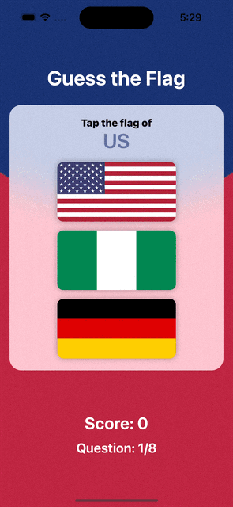

---
### Project 3: View And Modifiers
Technique project focusing on two fundamental components of SwiftUI: views and modifiers.

---

### Challenge 2: Rock Paper Scissors
Brain training game that challenges players to win or lose at rock, paper, scissors.

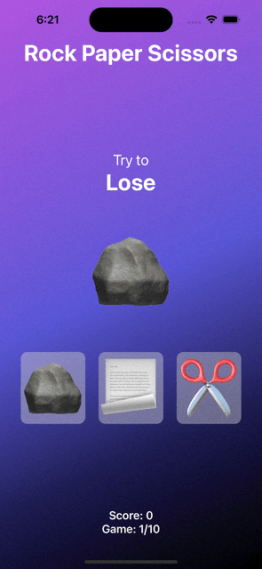

---

### Project 4: BetterRest
BetterRest is designed to help coffee drinkers get a good night’s sleep by asking them three questions:
- When do they want to wake up?
- Roughly how many hours of sleep do they want?
- How many cups of coffee do they drink per day?

We then use **CoreML** to get a result telling us when they need to go to bed. Using a technique called Regression Analysis we can ask the computer to come up with an algorithm able to represent all our data.

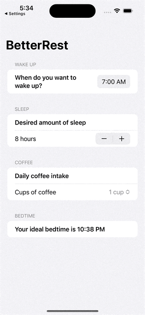

---

### Project 5: Word Scramble
This game shows players a random eight-letter word, and ask them to make words out of it. For example, if the starter word is “alarming” you might spell “alarm”, “ring”, “main”, and so on.

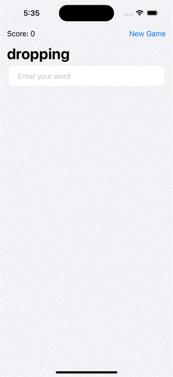

---

### Project 6: Animations
Technique project exploring a range of animations and transitions with SwiftUI.

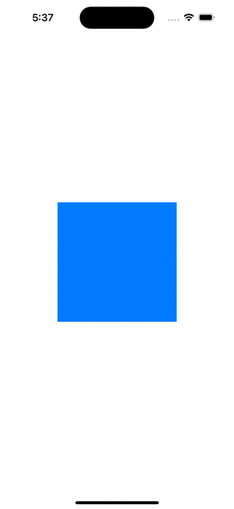

---

### Challenge 3: Multiplication Table
This app allows students to practice multiplication tables – “what is 7 x 8?” and so on.
Players can select a difficulty they want to practice, and how many questions they want to answer.
We then randomly generate questions accordingly.

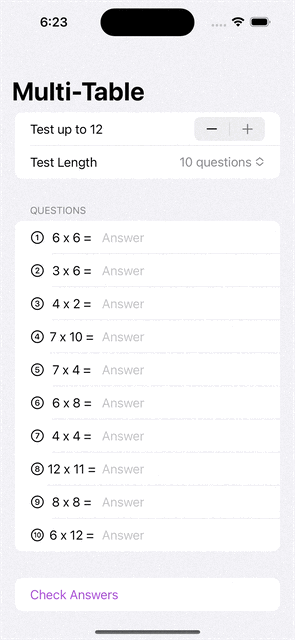

---

### Project 7: iExpense
An expense tracker that separates personal costs from business costs. 

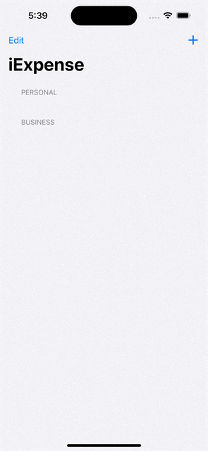

---

### Project 8: Moonshot
An app that lets users learn about the missions and astronauts that formed NASA’s Apollo space program.

---

### Project 9 - Drawing
Technique project focusing on drawing in SwiftUI, including creating custom paths and shapes, animating changes and  solving performance problems.

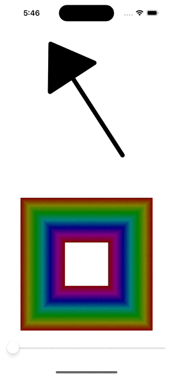

---

### Challenge 4: Habit Tracker
Habit-tracking app, for folks who want to keep track of how much they do certain things. That might be learning a language, practicing an instrument, exercising, or whatever – You get to decide which activities you add, and track it however you want.

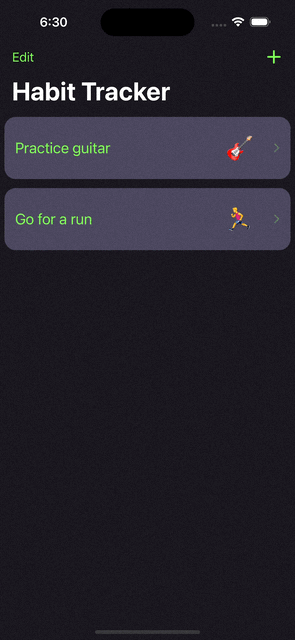

---

### Project 10 - Cupcake Corner
A multi-screen app for ordering cupcakes by sending and receiving the order data from the internet using **JSON** and **URLSession**.

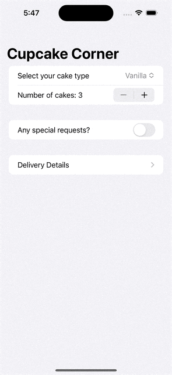

---

### Project 11 - Bookworm
An app to track which books you’ve read and what you thought of them, using **CoreData** as the database.

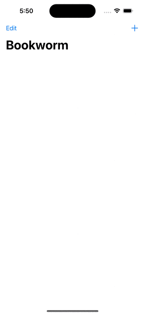

---

### Project 12: CoreData
Technique project exploring **CoreData** in more detail, starting with a summary of some basic techniques then building up to tackling some more complex problems.

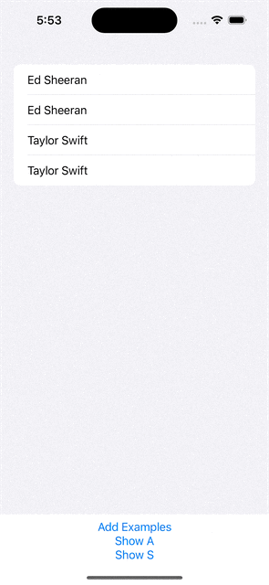

---

### Challenge 5: FriendsList
This app downloads a **JSON** file from a server using **URLSession**, containing data about your friends.
The app then convert the data to Swift and SwiftUI native objects, and display it in a pleasant way.

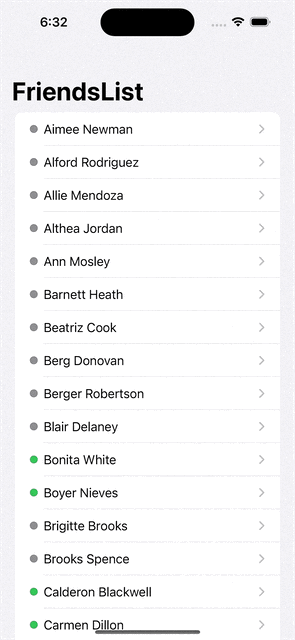

---

### Project 13: Instafilter
An app that lets the user import photos from their library, then modify them using various image effects, using **CoreImage**, and integrating with **UIKit**.

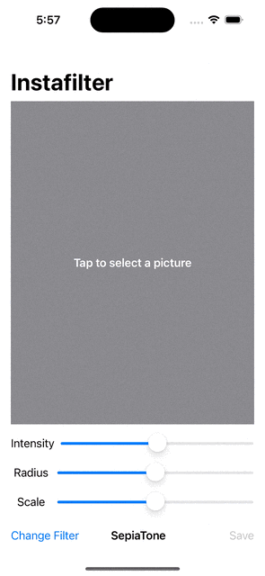

---

### Project 14: Bucket List
An app that lets the user build a private list of places on the map that they intend to visit one day, add a description for that place, look up interesting places that are nearby, and save it all to the iOS storage for later.
Using: **Biometric Unlock**, **MapKit**.

---

### Project 15: Accessibility
Making your app accessible means taking steps to ensure that everyone can use it fully regardless of their individual needs. For example, if they are blind then your app should work well with the system’s VoiceOver system to ensure your UI can be read smoothly.

This technique project explores a handful of accessibility techniques.

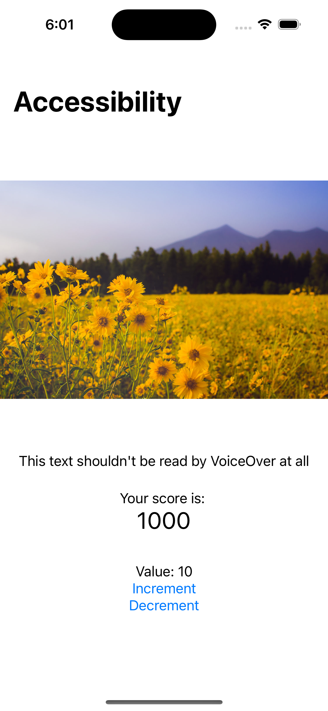

---

### Challenge 6: FaceFinder
Have you ever been to a conference or a meetup, chatted to someone new, then realized seconds after you walk away that you’ve already forgotten their name? You’re not alone, and this app will help solve that problem and others like it.

FaceFinder asks users to import a picture from their photo library, then attach a name.
The full collection of pictures you name is displayed in a list, and tapping an item in the list shows a detail screen with additional details, including where you met.

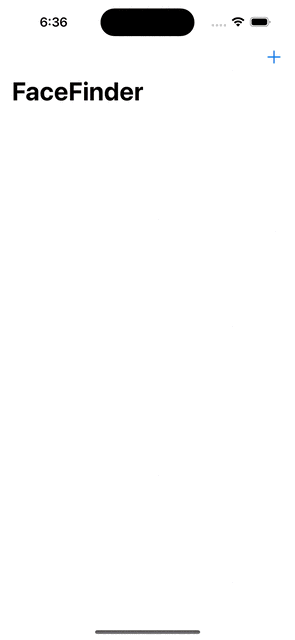

---

### Project 16: Hot Prospects
An app to track who you meet at conferences. It shows a QR code that stores your attendee information, then others can scan that code to add you to their list of possible leads for later follow up.

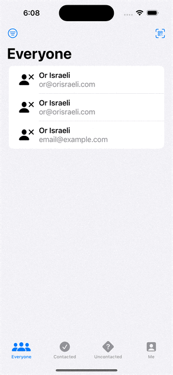

---

### Project 17: Flashzilla
An app that helps users learn things using flashcards – cards with one thing written on such as “to buy”, and another thing written on the other side, such as “comprar”.

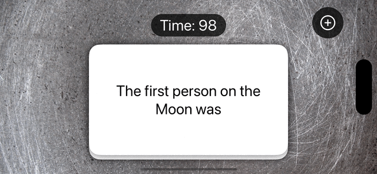

---

### Project 18: Layout and geometry
Technique project exploring how SwiftUI handles layout. Creating more advanced layout alignments, building special effects using GeometryReader, and more.

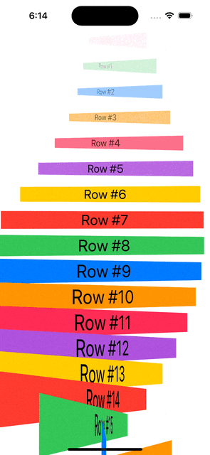

---

### Challenge 7: Dice Roll
An app that lets users roll dice (with **haptic feedback**), and lets them see results from previous rolls.
You can also customize the dice that are rolled: 4-sided, 6-sided, 8-sided, 10-sided, 12-sided, 20-sided, and even 100-sided.
The app stores the results locally using **JSON**.

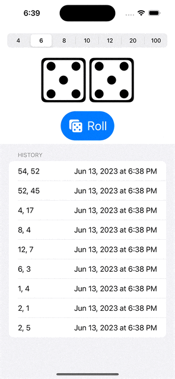

---

### Project 19: SnowSeeker
An app to let users browse ski resorts around the world, to help them find one suitable for their next holiday.
This app also works great on iPad by showing two views side by side (using **NavigationSplitView**).

---